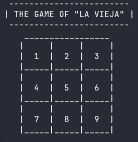
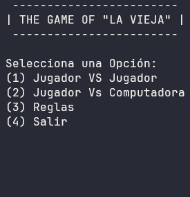
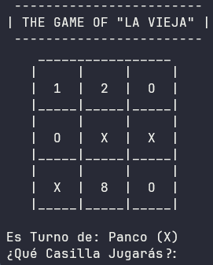
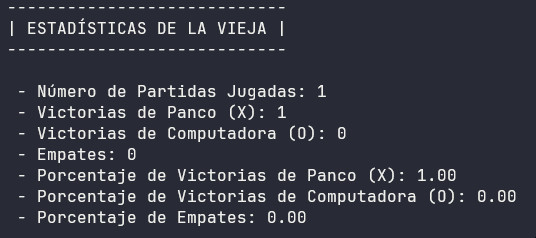

<h1 align="center" id="title">LA VIEJA</h1>

<div align="center">
  

  
</div>

<p id="description" align="center">El clásico juego de la vieja (tres en raya) en un tablero de 3x3. ¡Consigue alinear 3 símbolos antes que tu oponente! Incluye multijugador local, modo vs computadora y estadísticas detalladas. 🏆</p>

<h2 align="center">Tabla de Contenidos</h2>

- [Vista Previa](#vista-previa)
- [Características](#características)
- [Cómo jugar](#cómo-jugar)
- [Instalación](#instalación)
- [Creado con](#creado-con)
- [Autor](#autor)

## Vista Previa

<div align="center">



</div>

## Características

- 🕹️ Dos modos de juego: **Multijugador local** vs **Computadora**
- 🧠 **3 niveles de dificultad** para el modo vs IA
- 📊 Estadísticas detalladas:
  - Porcentaje de victorias/empates
  - Jugador con más victorias
  - Historial de partidas
- ✅ Interfaz intuitiva y fácil de usar

## Cómo jugar

- Cada jugador tendrá un único símbolo (X) o (O) que será la ficha que usará en la partida.
- Se le pedirá al usuario que ingrese el número de la casilla según el símbolo (X) o (O).
- Cada jugador solo debe colocar su símbolo una vez por turno y no debe ser sobre una casilla ya jugada.
- Se debe conseguir realizar una línea recta o diagonal por símbolo (X) o (O).
- El primer jugador que consiga marcar una línea de tres símbolos será el ganador.
- En caso de que todas las casillas estén llenas y nadie haya marcado 3 en raya, será un empate.

## Instalación ###

### Método 1: Ejecutable (Windows) ###

1. Descarga el archivo `LaVieja.exe` desde [Releases](https://github.com/PancoBits/LaVieja/releases).  
2. Haz doble clic para ejecutarlo (no requiere instalación).  

### Método 2: Compilar desde código ###

1. Clona el repositorio:  

   ```bash
   git clone https://github.com/PancoBits/LaVieja.git
2. Abre el archivo main.cpp en DevC++ 5.11.
3. Compila con F11 y ejecuta F10.

## Creado con ##

| Tecnología           | Versión   | Uso                |
|----------------------|-----------|--------------------|
|  | C++11     | Lógica del juego   |
|  | 5.11      | IDE de desarrollo  |

## Autor

**Franco Rodríguez**  
👔 [LinkedIn](https://www.linkedin.com/in/jeannrodriguez)
